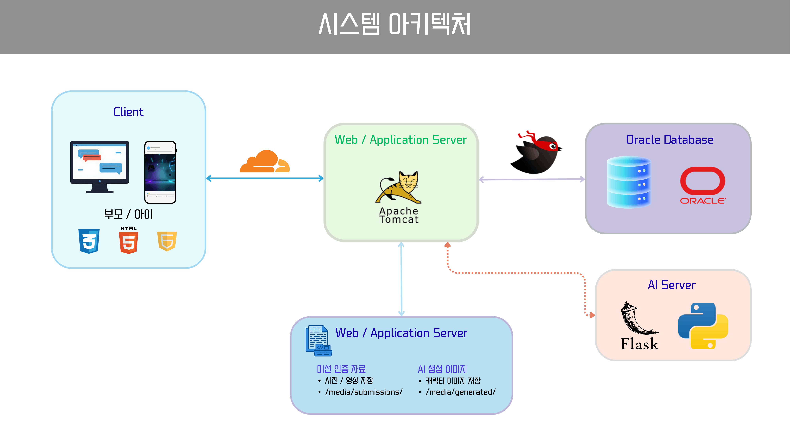
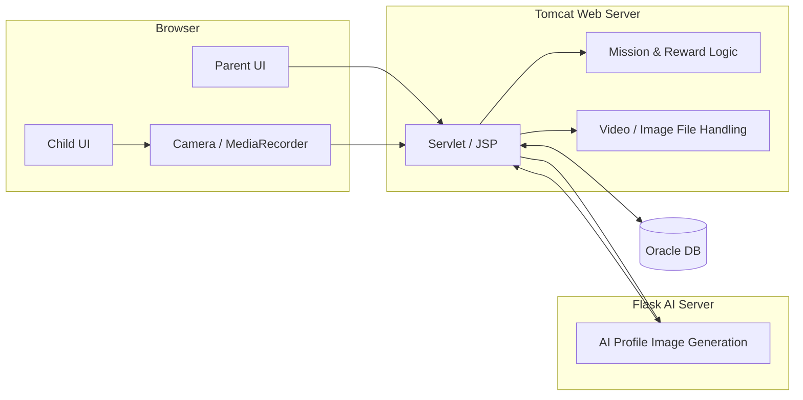
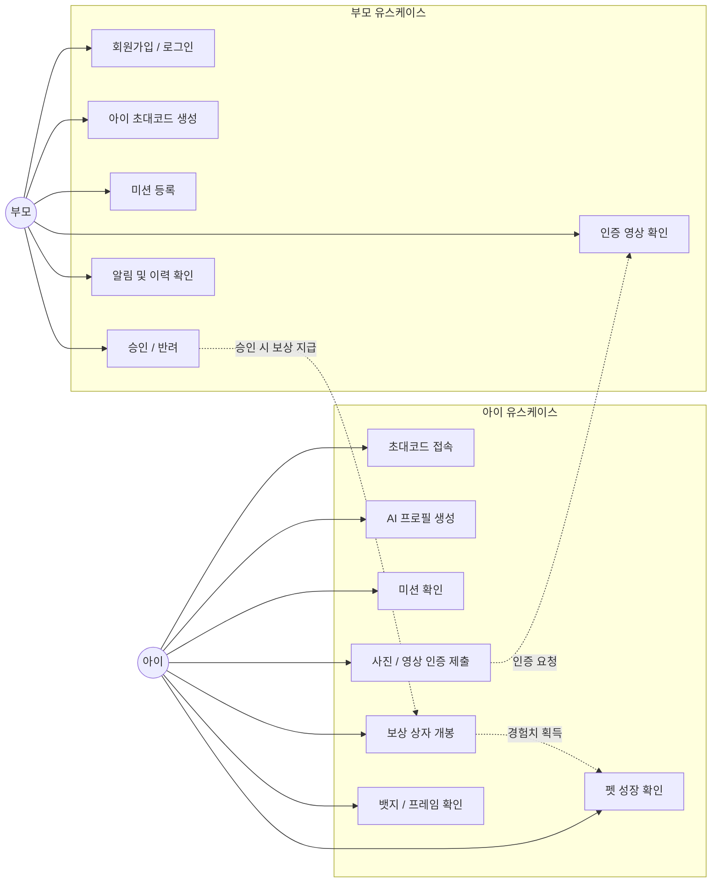
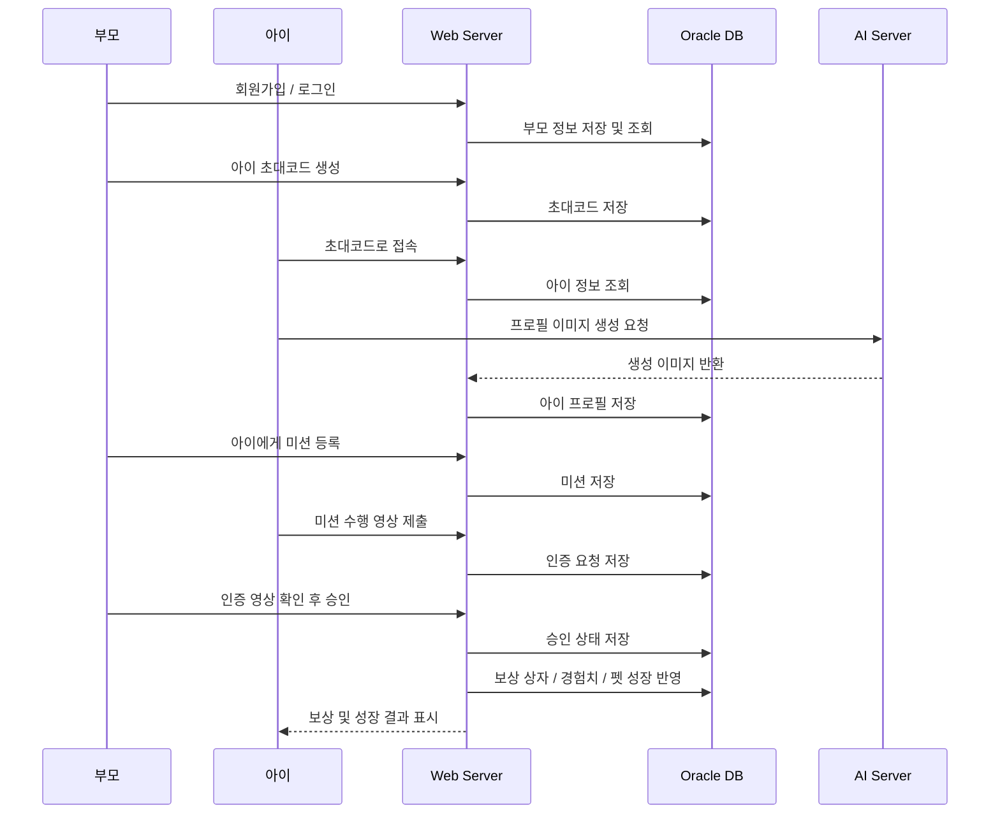
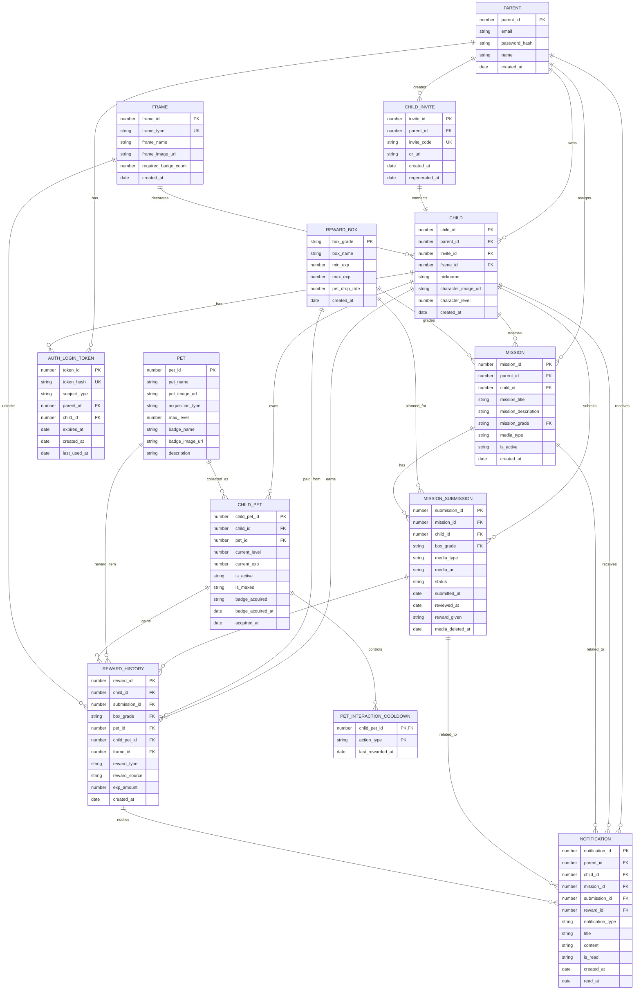

<div align="center">

# 아이 행동 습관 개선 서비스

### 영상 인증과 부모 승인, 펫 성장 보상으로 아이의 행동 습관 형성을 돕는 웹 서비스

> 아이는 미션을 수행하고 영상으로 인증합니다.  
> 부모는 인증 영상을 확인해 승인하고, 아이는 보상을 통해 펫을 성장시키며 습관을 이어갑니다.

**팀명 : 팀명 입력**

</div>

---

## 목차

1. [프로젝트 소개](#1-프로젝트-소개)
2. [서비스 소개](#2-서비스-소개)
3. [프로젝트 기간](#3-프로젝트-기간)
4. [주요 기능](#4-주요-기능)
5. [기술 스택](#5-기술-스택)
6. [시스템 아키텍처](#6-시스템-아키텍처)
7. [유스케이스](#7-유스케이스)
8. [서비스 흐름도](#8-서비스-흐름도)
9. [ER 다이어그램](#9-er-다이어그램)
10. [화면 구성](#10-화면-구성)
11. [팀원 역할](#11-팀원-역할)
12. [트러블슈팅](#12-트러블슈팅)
13. [실행 방법](#13-실행-방법)

---

## 1. 프로젝트 소개

| 항목 | 내용 |
| --- | --- |
| **프로젝트명** | 아이 행동 습관 개선 서비스 |
| **한 줄 소개** | 부모가 미션을 부여하고, 아이가 영상으로 인증하면 보상과 펫 성장으로 습관 형성을 유도하는 서비스 |
| **개발 인원** | 4명 |
| **주요 사용자** | 부모, 아이 |
| **핵심 가치** | 부모의 직접 확인과 게임형 보상을 결합한 행동 습관 형성 |

아이의 습관 형성은 단순히 "해야 할 일"을 알려주는 것만으로는 지속되기 어렵습니다.  
이 서비스는 부모가 아이에게 실천 미션을 부여하고, 아이가 수행 과정을 영상으로 인증하도록 구성했습니다.

부모가 영상을 확인해 승인하면 아이는 등급별 보상 상자를 얻고, 상자를 열어 획득한 경험치로 펫을 성장시킬 수 있습니다.  
즉, **실제 행동 수행 → 보호자 확인 → 즉각적인 보상 → 성장 경험**의 흐름을 통해 아이가 스스로 행동 습관을 이어가도록 돕는 것이 목표입니다.

---

## 2. 서비스 소개

> **"아이의 행동은 기록되고, 부모의 확인은 보상이 됩니다."**

- **부모 미션 부여**  
  부모가 아이에게 수행할 행동 미션을 직접 등록하고 난이도별로 관리합니다.

- **아이 영상 인증**  
  아이는 미션을 수행한 뒤 영상으로 인증 요청을 보냅니다.

- **부모 승인 / 반려**  
  부모는 제출된 영상을 확인하고 승인 또는 반려할 수 있습니다.

- **등급별 보상 상자**  
  승인된 미션 등급에 따라 하급, 중급, 상급 상자가 지급됩니다.

- **펫 성장 시스템**  
  상자를 열어 얻은 경험치로 펫을 성장시키고, 성장 완료 시 뱃지를 획득합니다.

- **프로필 꾸미기 요소**  
  획득한 뱃지 수에 따라 아이 프로필 액자 프레임이 잠금 해제됩니다.

- **AI 프로필 이미지 생성**  
  아이가 선택한 옵션을 기반으로 AI 서버가 캐릭터 프로필 이미지를 생성합니다.

---

## 3. 프로젝트 기간

**2026.05 ~ 2026.06**

---

## 4. 주요 기능

### 부모 기능

- 이메일 / 비밀번호 기반 회원가입 및 로그인
- 아이 초대코드 생성 및 재발급
- 아이별 미션 등록, 수정, 관리
- 아이가 제출한 미션 인증 영상 확인
- 인증 요청 승인 / 반려
- 미션 수행 이력 및 보상 지급 내역 확인

### 아이 기능

- 초대코드 기반 접속
- 오늘 수행 가능한 미션 확인
- 미션 수행 영상 촬영 및 업로드
- 승인 결과 확인
- 보상 상자 획득 및 개봉
- 펫 경험치 획득, 레벨업, 성장 상태 확인
- 획득 뱃지와 잠금 해제된 프레임 확인

### 미션 진행 규칙

| 구분 | 내용 |
| --- | --- |
| **하루 수행 횟수** | 총 5회 |
| **하급 미션** | 1회 수행 가능 |
| **중급 미션** | 하급 성공 후 1회 수행 가능 |
| **상급 미션** | 중급 성공 후 최대 3회 수행 가능 |
| **보상 지급 조건** | 부모가 인증 영상을 승인한 경우 |

### 보상 구조

| 보상 요소 | 설명 |
| --- | --- |
| **보상 상자** | 미션 등급에 따라 하급 / 중급 / 상급 상자 지급 |
| **경험치** | 상자 개봉 시 등급별 범위 안에서 랜덤 경험치 지급 |
| **펫 성장** | 경험치 누적으로 펫 레벨 상승 |
| **뱃지** | 펫 성장 완료 시 획득 |
| **프레임** | 누적 뱃지 수에 따라 아이 프로필 액자 프레임 잠금 해제 |

---

## 5. 기술 스택

### Frontend


- HTML / CSS / JavaScript
- `getUserMedia`, `MediaRecorder API` 기반 영상 촬영
- 부모 / 아이 역할별 화면 구성
- Figma 기반 화면 설계안을 바탕으로 UI 구현

### Backend


- Java Servlet / JSP
- Apache Tomcat 9 기반 웹 애플리케이션 실행
- Maven 기반 빌드 및 의존성 관리
- MyBatis 기반 SQL Mapper를 통한 Oracle DB 연동
- 미션, 인증 요청, 보상, 펫 성장 로직 처리
- 세션 기반 로그인 상태 관리

### AI Server


- Flask 기반 AI 이미지 생성 서버
- Stable Diffusion 계열 모델을 활용한 캐릭터 프로필 이미지 생성
- Java 백엔드에서 AI 서버로 옵션 전달 후 이미지 결과 수신

### Database


- Oracle DB
- 부모, 아이, 미션, 인증, 보상, 펫, 프레임 데이터 관리

### Tools


- Figma 기반 화면 설계
- Git / GitHub 협업
- VS Code


---

## 6. 시스템 아키텍처




---

## 7. 유스케이스



---

## 8. 서비스 흐름도



---

## 9. ER 다이어그램



---

## 10. 화면 구성

### 시연 영상


[시연 영상 보기](https://drive.google.com/file/d/1fxKaVg2gZ5Aw22fUztUQeQzf1zSx42Qa/view?usp=sharing)

### 핵심 화면

| 화면 | 사용자 | 설명 |
| --- | --- | --- |
| 로그인 / 회원가입 | 부모 | 이메일과 비밀번호로 부모 계정 생성 및 로그인 |
| 아이 초대 | 부모 | 아이 접속용 초대코드 생성 및 재발급 |
| 미션 관리 | 부모 | 아이에게 수행 미션 등록 및 관리 |
| 인증 요청 목록 | 부모 | 아이가 제출한 영상을 확인하고 승인 / 반려 |
| 아이 홈 | 아이 | 오늘 수행 가능한 미션과 진행 상태 확인 |
| 영상 인증 | 아이 | 카메라로 미션 수행 영상을 촬영하고 제출 |
| 보상 상자 | 아이 | 승인된 미션 보상 상자 개봉 |
| 펫 성장 | 아이 | 획득 경험치로 펫 성장 상태 확인 |
| AI 프로필 생성 | 아이 | 선택 옵션 기반 캐릭터 프로필 이미지 생성 |

|  |  |
| :---: | :---: |
| **부모 홈** | **아이 홈** |

|  |  |
| :---: | :---: |
| **미션 영상 인증** | **펫 성장** |

---

## 11. 팀원 역할

| 이름 | 역할 | 담당 업무 |
| :---: | :---: | --- |
| **팀원 1** | PM / Backend | 프로젝트 일정 관리, Servlet/JSP 기반 서버 로직, DB 연동 |
| **팀원 2** | Frontend | 부모 / 아이 화면 구현, 미션 인증 UI, 보상 및 펫 화면 구현 |
| **팀원 3** | AI / Backend | Flask AI 서버, AI 프로필 이미지 생성 연동 |
| **팀원 4** | DB / 문서화 | Oracle DB 설계, 요구사항 정의서, 발표 자료 및 README 문서화 |

---

## 12. 트러블슈팅

<table>
<tr>
<td width="30%"><b>부모 / 아이 세션 충돌</b></td>
<td>

**문제** — 같은 브라우저에서 부모와 아이 로그인을 번갈아 수행할 때 이전 역할의 세션 정보가 남아 잘못된 화면으로 이동할 수 있었습니다.

**해결** — 로그인 시 역할별 세션 값을 명확히 분리하고, 새 로그인 또는 초대코드 재발급 시 기존 아이 세션을 제거하도록 처리했습니다.

</td>
</tr>

<tr>
<td><b>영상 인증 화면 상태 초기화</b></td>
<td>

**문제** — 상호작용 애니메이션이나 화면 재렌더링 과정에서 영상 영역의 크롭, 위치, 선택 상태가 초기값으로 덮어써지는 문제가 있었습니다.

**해결** — UI에만 의존하던 값을 별도 상태값으로 분리하고, 재렌더링 이후에도 기존 선택 상태가 유지되도록 관리했습니다.

</td>
</tr>

<tr>
<td><b>AI 서버 요청 데이터 불일치</b></td>
<td>

**문제** — Java 백엔드에서 Flask 서버로 전달하는 JSON 키와 Flask 서버에서 읽는 키 이름이 달라 기본값이 적용되거나 400 오류가 발생했습니다.

**해결** — 요청 키를 `gender`, `user_emotion`, `background`, `glasses` 기준으로 정리하고, Java와 Flask 양쪽의 기본값 및 파라미터 이름을 맞췄습니다.

</td>
</tr>

<tr>
<td><b>모바일 접속 환경 문제</b></td>
<td>

**문제** — PC에서는 `localhost`로 접속 가능했지만 같은 네트워크의 모바일 기기에서는 접속이 되지 않는 문제가 있었습니다.

**해결** — Tomcat이 `0.0.0.0`으로 LISTEN 중인지 확인하고, 모바일에서는 서버 PC의 내부 IP와 포트로 접속하도록 정리했습니다.

</td>
</tr>

<tr>
<td><b>프로필 프레임 크기 불일치</b></td>
<td>

**문제** — 아이 프로필 액자 프레임 이미지가 프로필 박스보다 작거나 크게 표시되어 테두리가 정확히 맞지 않았습니다.

**해결** — 프레임 이미지의 실제 여백을 조정하고, CSS의 `position`, `inset`, `object-fit`, `border-radius` 값을 함께 조정해 박스 경계와 프레임이 맞도록 개선했습니다.

</td>
</tr>
</table>

---

## 13. 실행 방법

### Backend

```bash
# Maven 빌드
mvn clean package
```

빌드 후 생성된 `war` 파일을 Tomcat `webapps` 폴더에 배포합니다.

### Tomcat 실행

```bash
# Windows
startup.bat
```

또는 개발 중에는 VS Code Tomcat 확장 기능을 통해 서버를 실행할 수 있습니다.

### AI Server

```bash
python app.py
```

Flask AI 서버 실행 후 Java 백엔드의 AI 서버 URL 설정값을 실제 Flask 주소로 맞춰야 합니다.

### 접속

```text
http://localhost:8080/{context-path}/
```

같은 네트워크의 모바일 기기에서 접속할 경우 `localhost` 대신 서버 PC의 내부 IP를 사용합니다.

```text
http://{server-ip}:8080/{context-path}/
```

---

## 향후 개선 방향

- 미션 카테고리 다양화
- 부모용 통계 대시보드 추가
- 아이별 습관 수행률 시각화
- AI 프로필 옵션 확장
- 영상 인증 파일 저장 방식 개선
- 배포 환경 구성 및 외부 접속 안정화

<div align="center">

**아이 행동 습관 개선 서비스**

</div>
